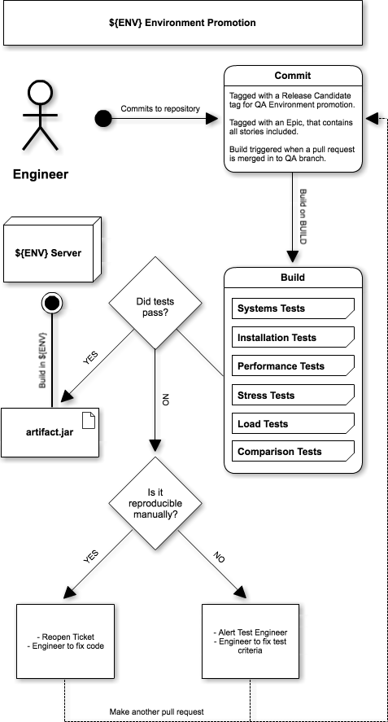

# Environment Promotion

See original document [here](../images/umls/Environment_Promotion_v1.pdf).

## Additions

## Notes

1. Engineer refers to any and all resources responsible of comitting code to the codebase, including tests.
2. Assuming Engineers have permission to tag and release code on git.
4. We should treat environment promotion agnostically, hollistic, first, then we should look at special, reductionist, cases.

## Questions

1. Does this work in the event of a HOTFIX or ROLLBACK event?
