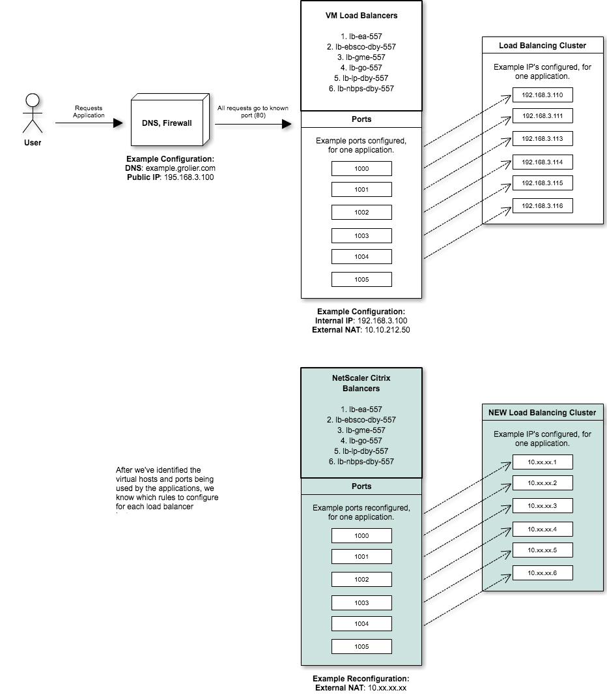
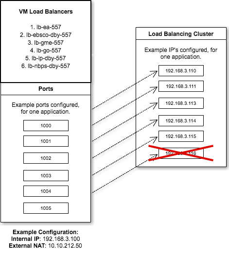
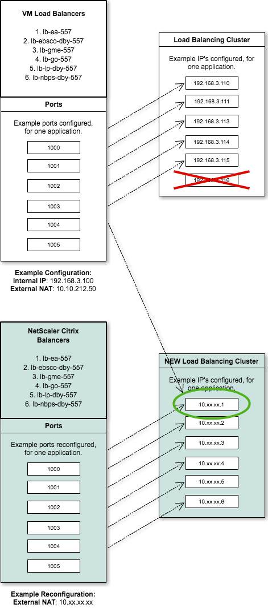
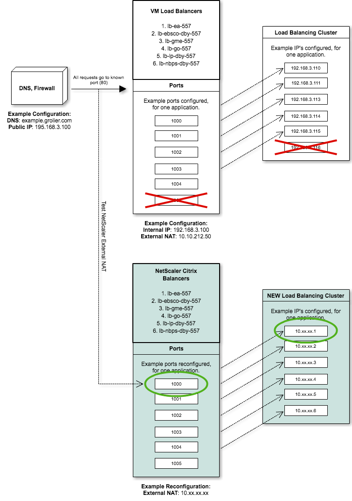
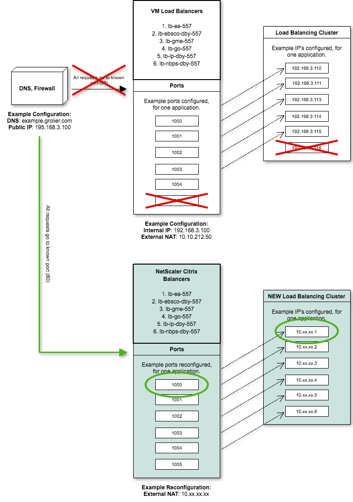
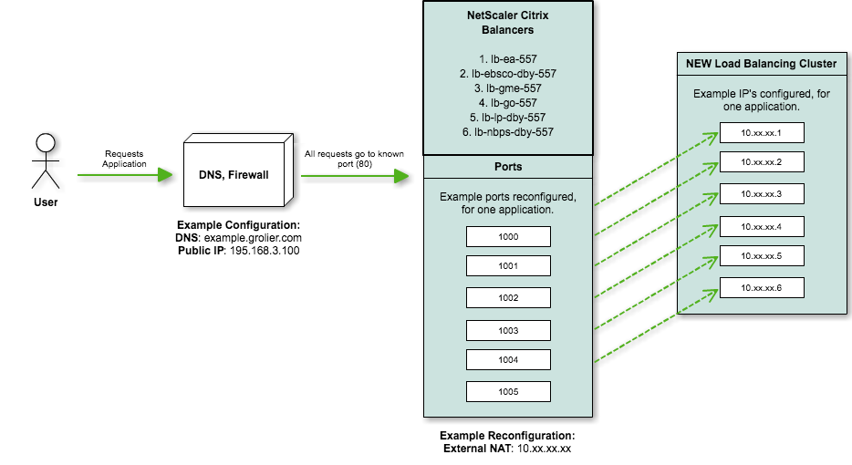

# Load Balancer Re-Platforming Plan

| Project | JIRA |
| --- | --- |
| Go Server Migration | [Agile Board](https://jira.sts.scholastic.com/secure/RapidBoard.jspa?rapidView=933) |

## Document

### Author

**Sajjad Hossain**  
**E:** [shossain@scholastic.com](shossain@scholastic.com)  
**C:** 347-661-3441   
1271 Avenue of America,  
New York, NY  10020, 
United States,  
32-414B  

### History

| Version | Author | Date |
| --- | --- | --- |
| 0.0.1 | Sajjad Hossain | June 19, 2017 |
| 0.1.0 | Sajjad Hossain | June 20, 2017 |
| 1.0.0 | Sajjad Hossain | June 20, 2017 |

## Abstract

We are re-platforming all of our application load balancers to use Citrix, a load balancing solution. We will switch these servers after conducting a Proof of Concept (POC). After the POC passes testing and acceptance criteria. 

## Scope

The scope of work covered by this load balancer re-platforming plan ensures that all load balancers in the [load balancers](#loadbalancers) section of this plan is analyzed, and re-platformed to Citrix NetScaler solution and kept alive (with accruing costs) in the Scholastic virtual machine space. 

### Applications load balanced by machines

| Name |
| --- |
| Encyclopedia Americana |
| EBSCO |
| Grolier Multimedia Encyclopedia |
| Grolier Online |
| Lands and People |
| New Book of Popular Science |
| Nueva Encyclopedia Cumbre |

## Personnel

| Name | Role | Sprint Commitment to GSM |
| --- | --- | --- |
| [Sajjad Hossain](shossain@scholastic.com) | Project Owner | 100% |
| [Sanjay Dabhi](SDabhi@Scholastic.com) | Overseeing 557 Shutdown | ~ 2.5% |
| [Wayne Christie](WChristie-Vendor@Scholastic.com) | Network Resource | ~ 2.5% |
| [Mohammed Azad](MAzad-Vendor@Scholastic.com) | Data Center Resource | ~ 2.5% |
| [Praveen Kalevala](PKalevala-consultant@Scholastic.com) | Server Configuration Resource | ~ 2.5% |

### Stakeholders and affected parties

| Application Space | Stakeholder | Escalation Lead |
| --- | --- | --- |
| Encyclopedia Americana | [Allison Henderson](AHenderson@ScholasticLibrary.com) | []() |
| EBSCO | [Allison Henderson](AHenderson@ScholasticLibrary.com) | []() |
| Grolier Multimedia Encyclopedia | [Allison Henderson](AHenderson@ScholasticLibrary.com) | []() |
| Grolier Online | [Allison Henderson](AHenderson@ScholasticLibrary.com) | []() |
| Lands and People | [Allison Henderson](AHenderson@ScholasticLibrary.com) | []() |
| New Book of Popular Science | [Allison Henderson](AHenderson@ScholasticLibrary.com) | []() |
| Nueva Cumbre Encyclopedia | [Allison Henderson](AHenderson@ScholasticLibrary.com) | []() |

## Load Balancers

* All servers are identified [here](https://docs.google.com/spreadsheets/d/1GmL_qVQtMtzl2Us7eQlcVobOVAeEVe8UvH3wmxnj-yU/edit#gid=71094125).
* There are a total of **6** load balancers that fall under the scope of this plan. 
* They are:
	1. lb-ea-557
	2. lb-ebsco-dby-557
	3. lb-gme-557
	4. lb-go-557
	5. lb-lp-dby-557
	6. lb-nbps-dby-557


## Clusters

The load balancers included in these clusters are the **6** that fall within the scope of the **Re-Platforming Plan**. 

| ID | Cluster Name | # of Machines | Products/Services | 
| --- | --- | --- | --- |
| 12 | Danbury Loadbalancers | 7 | Content, GME, GO, LP, NBPS, EA, EBSCO, GME |

## Epics

### Load Balancers Re-platforming

```gherkin
As a lead
I want to use the NetScaler Citrix solution
So that I can retire the load balancers in 557
```

#### Stories

1. [GSM-160](https://jira.sts.scholastic.com/browse/GSM-160)
2. [GSM-155](https://jira.sts.scholastic.com/browse/GSM-155)
3. [GSM-150](https://jira.sts.scholastic.com/browse/GSM-150)
4. [GSM-145](https://jira.sts.scholastic.com/browse/GSM-145)
5. [GSM-185](https://jira.sts.scholastic.com/browse/GSM-185)
6. [GSM-196](https://jira.sts.scholastic.com/browse/GSM-196)


## Definition of done
There is **1** state of completion, outcome of planning, analysis and execution for all Load balancers.

### Keep Alive

These load balancers will be kept alive in new virtual machines, the load balancers will be `Retired`.  The new virtual machines will occupy less space in another data center using the `NetScaler: Citrix` solution after it has completed a POC in lower environments.

## Acceptance Criteria

### Criteria for Proof of Concept

```gherkin
GIVEN I am a lead
AND I have implemented my solution in a lower environment
AND I have tested my new system
AND I have tested my application in the new system
AND I have tested my internal IP access
AND I have tested my external IP access
THEN I can approve my proof of concept
```

#### Criteria for Re-Platforming

```gherkin
GIVEN I am a developer
AND I identified the DNS
AND I identified the external IP
AND I identified internal IP
THEN I can configure a Citrix scale solution
AND I notified affected teams and stakeholders of outages or downtimes
AND I provided a rollback strategy
WHEN I switch the external NAT to the new IP
THEN my load balancer is re-platformed
WHEN I test all my identified applications
THEN they should pass request load balancing tests
```

## Strategy

For all of our load balancers being re-platformed, the strategy remains the same. 

### 1. Set up NetScaler solution
Set up a NetScaler Citrix load balancer, using the same configurations, rules and ports as our current load balancers. **The Citrix solution is shown below in teal.** 



### 2. Shut down one application virtual machine 
Shut down one virtual machine in the original load balancing cluster.



### 3. Point the load for a single port to the Citrix load balancer
Redirect all request for a single port on the virtual machine load balancer, to the 10.x.x.x series. This would direct all traffic made to an identified port, to our new Citrix solution, making it available for testing. During this step, we will test that our requests to the specified port are being redirected as needed.



### 4. Add rule in NetScaler to redirect traffic from External NAT to the new port
Here, we expect a short downtime. The rule in NetScaler would direct all requests to the External NAT, from within Scholastic network to the Citrix load balancer. This would allow us to test requests made directly to the External NAT to test that traffic is directed as needed.



### 5. Cutover. Attach the new External NAT to DNS
Here, we expect a short outage time while the DNS is being routed to the one load balancer. Teams affected should be aware. During this step we will test requests made from outside the Scholastic network, directly to the DNS. **All requests should be directed to the same Citrix load balancing instance.**



### 6. Final cutover
During this step, we repeat steps 2 to 5 for all of our remaining load balancers within the cluster for the given application. All requests, internal or external, with or without ports, will be directed to the new Citrix load balancing solution.



## Rollback

Rolling back our proposed solution is much simpler for this plan. Steps 2 to 5 require editing values to match the new parameters for certain configuration files. Given that during time of cutover, these machines will remain available and not in use, rollback requires editing the configurations to the their previous values. The downtimes and outages will remain minimal, and upon refresh, requests would return to their normal load balancing methodology.

## Release Notes

### Improvements

1. Currently we use [HAProxy](http://www.haproxy.org/). This service does not provide service discovery. If there are downtimes or outages for any applications load balanced, then the requests made would fail. [Citrix](https://www.citrix.com/products/netscaler-adc/netscaler-data-sheet.html) provides service discovery so that if there are downtimes or outages, requests would be **automatically** directed to an endpoint that is up. 
2. In addition, HAProxy requires heavy manual configuration. When executing requests to implement a load balancer or separate instance, Citrix allows simple configuration to complete the task. The new systems via Citrix are better isolated and manipulatable. 
3. Lastly, our current load balancing for certain applications with higher load, i.e. GO!, we can spin and tear load balancers from the cluster with minimal work and **no** downtime. This means we can re-platform and migrate to the new data center, while consuming less virtual machine disk space as we wouldn't start with 6 instances for the example of GO!.

### Monitoring

At the request of Jenhau Chen, we need to implement monitoring to better prepare for outages and downtimes. After speaking with Sanjay, it is simple to implement and we have multiple solutions available. 

- [Sensu](https://sensuapp.org/)
- [New Relic](https://newrelic.com/)
- [Nagios](https://www.nagios.org/)

To implement monitoring there are **3** requirements needed by Sanjay's team. They are:

1. **Distribution List**: Who will be informed of downtimes, outages, etc.
2. **Budget Approval**: This will require additional costs to implement as there is no monitoring in place for these load balancers.
3. **Metrics and Benchmarks**: We need to identify, for each application being load balanced:
	1. What is the maximum memory allotted for these services/products?
	2. What is the maximum disk space allotted for these services/products?
	3. What qualifies these as downtime for for these services/products?
	4. *More to be defined when approved...*

## Schedule

These stories will be completed as apart of the **Velociraptor** sprints.

| Stories | JIRA | Start Sprint | End Sprint |
| --- | --- | --- | --- |
| Implement NetScaler for NBPS | [GSM-160](https://jira.sts.scholastic.com/browse/GSM-160) | 15.3 (June 14, 2017) | 15.3 (June 28, 2017)  |
| Implement NetScaler for NEC | [GSM-155](https://jira.sts.scholastic.com/browse/GSM-155) |||
| Implement NetScaler for LP | [GSM-150](https://jira.sts.scholastic.com/browse/GSM-150) |||
| Implement NetScaler for GO | [GSM-165](https://jira.sts.scholastic.com/browse/GSM-165) |||
| Implement NetScaler for GME | [GSM-185](https://jira.sts.scholastic.com/browse/GSM-185) |||
| Implement NetScaler for EA | [GSM-145](https://jira.sts.scholastic.com/browse/GSM-145) |||
| Implement NetScaler for EBSCO | [GSM-196](https://jira.sts.scholastic.com/browse/GSM-196) |||

## Risks

1. Unknown -- Unknown