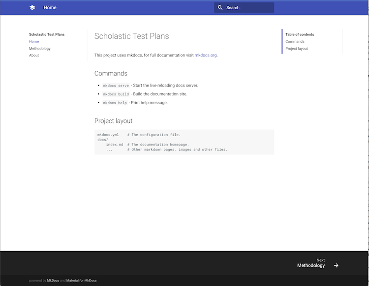
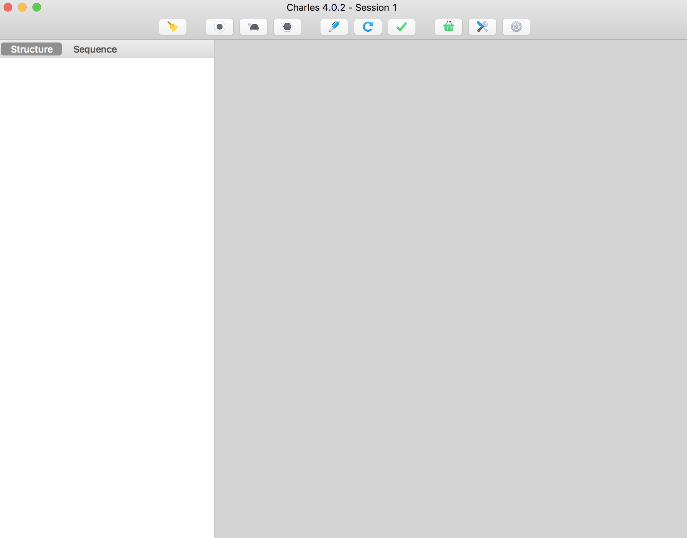
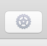
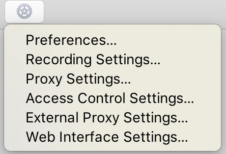
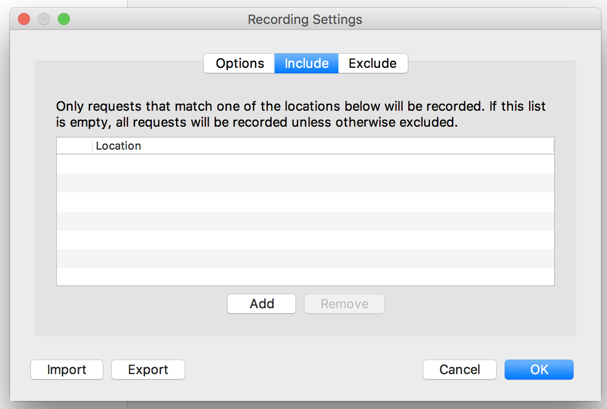
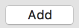
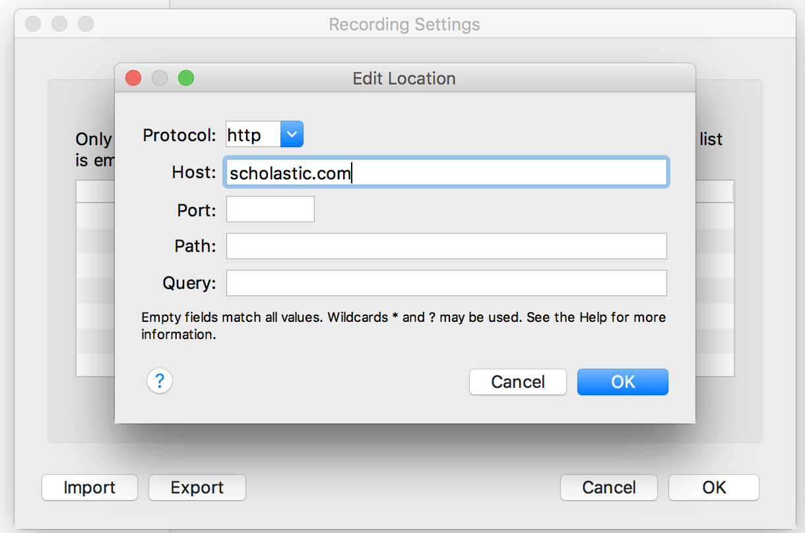

# Charles (for Blackbox Testing)

If prefferred, download [Charles](http://www.charlesproxy.com/download/). This tool, like JMeter, is powerful tool that tells you what exactly is going on when using a website. It can even be used to sniff iOS and Android http/https requests, let alone API's.  

As soon as you open Charles and play around outside the app, you'll notice data being collected in the left-tab. Every HTTP/HTTPS request being made is monitored. The data obtained will help test and make API/URI/URL requests.

`AUT` = Application Under Test

| Step | Description | Screenshot |
| --- | --- | --- |
| 1 | Open the AUT in your browser of choice. For this example, lets use Chrome on Mac OS X. |   |
| 2 | Open **Charles**. |  |
| 3 | From the toolbar, select **Settings**. |  |
| 4 | From Settings, select **Recorder Settings**. |  |
| 5 | From Recorder Settings, select **Include** tab. |  |
| 6 | From Include Tab, press **Add** tab. |  |
| 7 | In the "Include" section, limit the recorder to sniff only requests made from **Scholastic** servers. This is called whitelisting. |  |

Your recording settings should reflect as follows. Be sure to include the server of the click-through. Refresh the AUT.

Until now your requests log should've been either empty or full of other requests from your computer. You should see requests being populated from **Scholastic** servers.
